**Authmen NFT****挖矿教程**

开始前请确保钱包中有足够的ETH支付GAS费用。

 

**开启挖矿前，你需要进行两个步骤：**

**1****、存入一个Authmen NFT；**

**2****、质押Uniswap LP Token。**

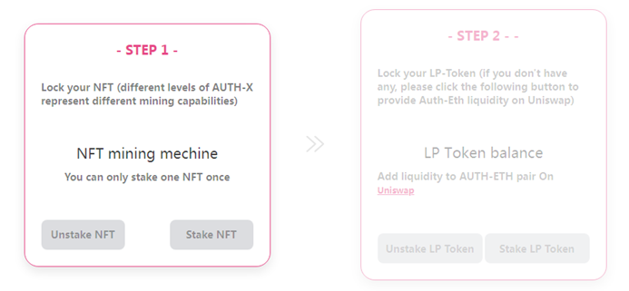

 

**获取Authmen NFT**

在首次挖矿前，你有两个方法获取Authmen NFT：

1、消耗60个AUTH来获取一个AUTH-1；

2、锁定 2,000,000 Trias Token（TRY）30天获取一个免费的AUTH-1 。

 

**方法一（消耗AUTH）步骤**

1、进入https://app.auth.men/home页面，连接钱包；

2、选择「Authmen Production」；

3、点击「Burn」按钮；

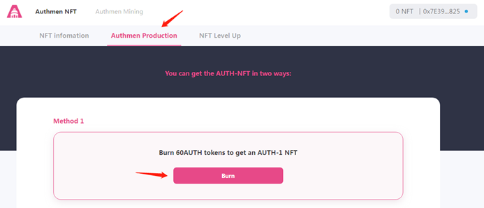

4、在弹出的钱包页面中点击「Confirm」确认授权；

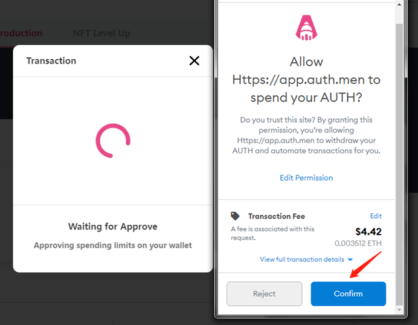

5、继续点击「Confirm」确认支付GAS费用；

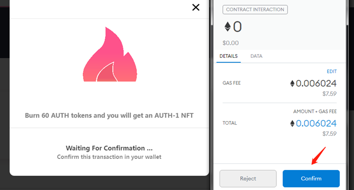

6、成功消耗60AUTH获得一个AUTH-1 ！

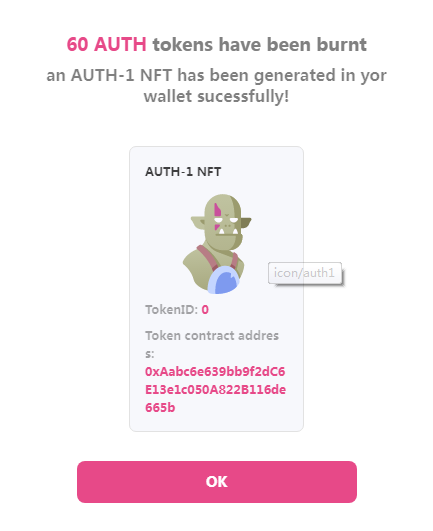

 

**方法二（锁仓TRY）步骤**

1、进入https://app.auth.men/home页面，连接钱包；

2、选择「Authmen Production」；

3、点击「Lock TRY」按钮；

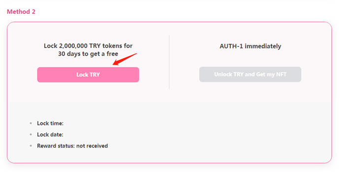

4、点击「Confirm」确认锁仓；

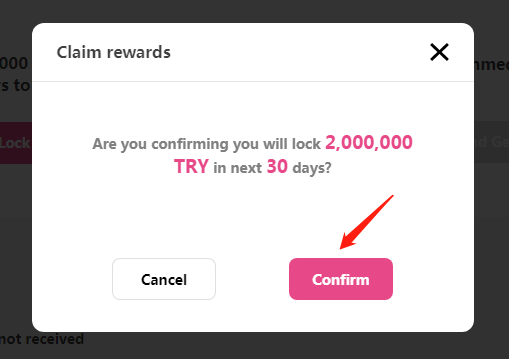

5、继续点击「Confirm」确认锁仓TRY；

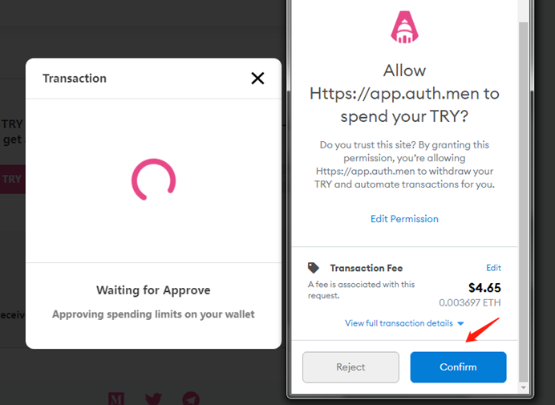

6、确认支付GAS费用；

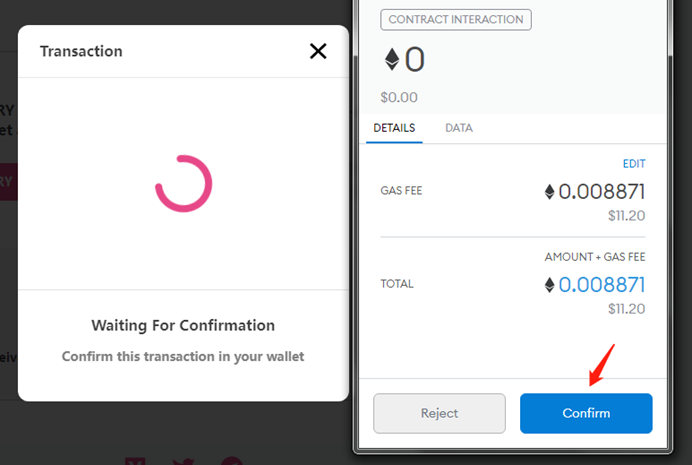

7、完成锁仓，你将在30天后获得一个免费的AUTH-1！

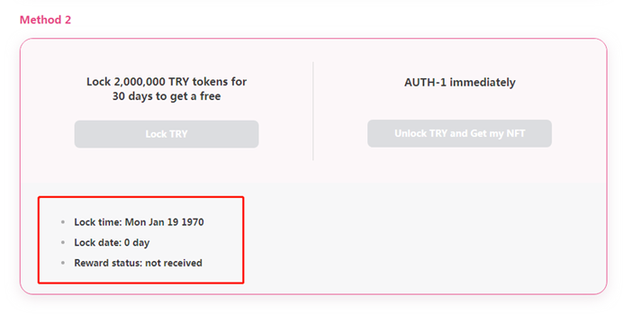

 

**获取Uniswap LP Token**

目前你已经完成挖矿的第一步——获得一个Authmen NFT，接下来你需要质押Uniswap LP Token来开始挖矿。

 

1、进入https://app.uniswap.org/#/pool，连接钱包；

2、点击「Add Liquidity」；

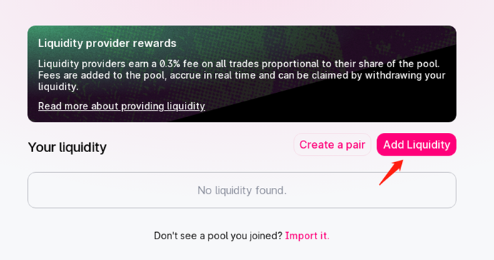

3、在第二个Input后面，点击「选择通证」；

4、在弹出的窗口中，输入Authmen的合约地址，点击「Import」；

0x89aeca7d3cc04f50e9d2bb635ad84fe8f7e77a9d

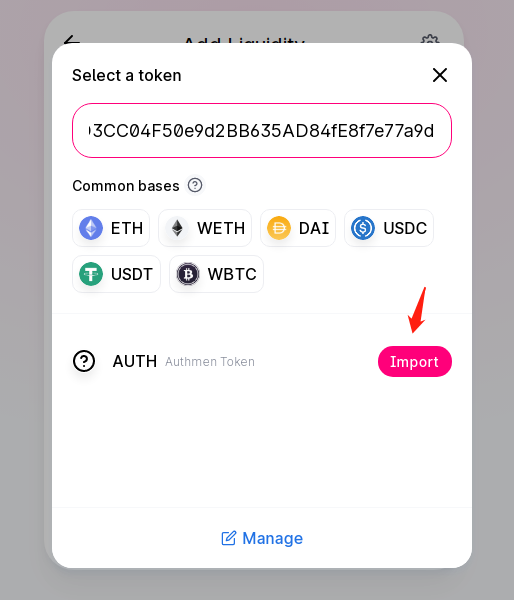

5、调整适当的ETH和AUTH，点击「Approve AUTH」；

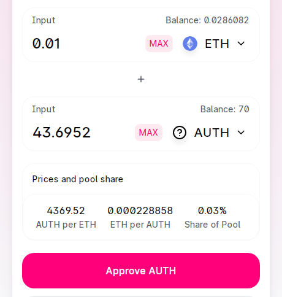

6、点「Confirm」等待以太坊网络确认；

7、点击「Supply」；

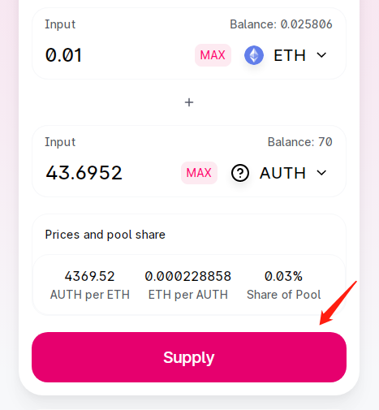

8、点击「Confirm Supply」；

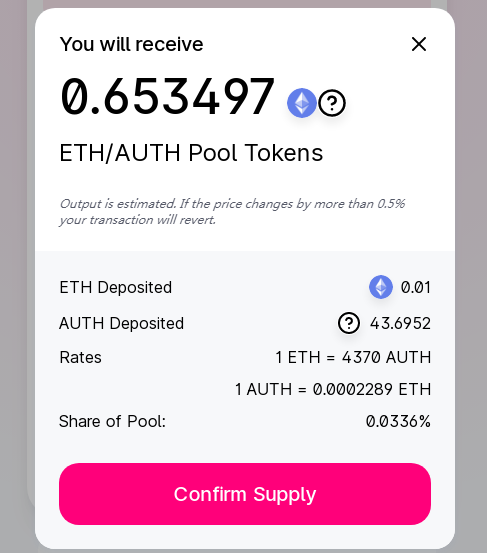

9、点击「Confirm」确认支付GAS费用；

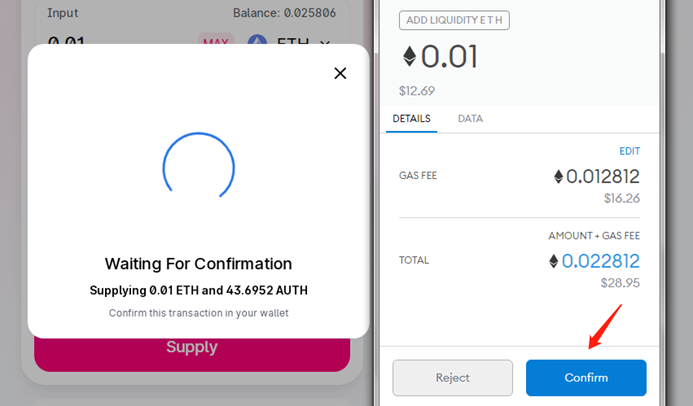

10、等待以太坊网络确认即可。

 

**开始挖矿**

**质押Authmen NFT**

1、进入https://app.auth.men/mining页面；

2、点击「Stake NFT」按钮；

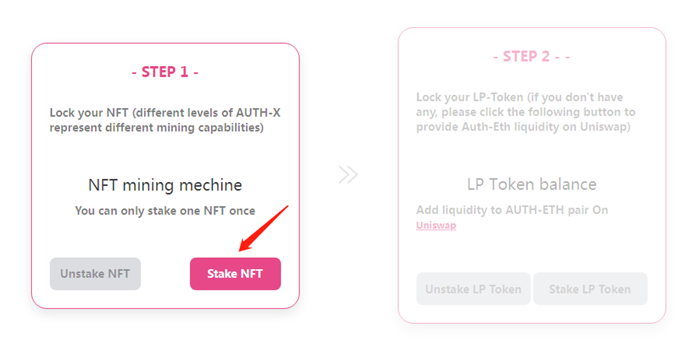

3、确认你将质押的Authmen NFT；

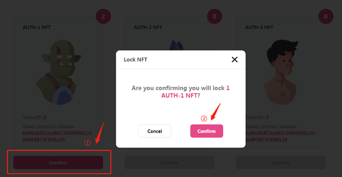

4、确认支付GAS费用；

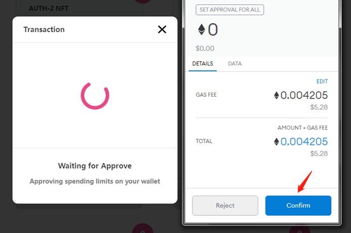

5、成功质押一个AUTH-1！

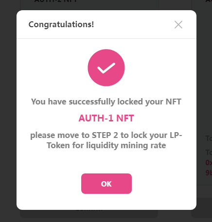

 

**质押Uniswap LP Token**

1、点击「Stake LP Token」按钮；

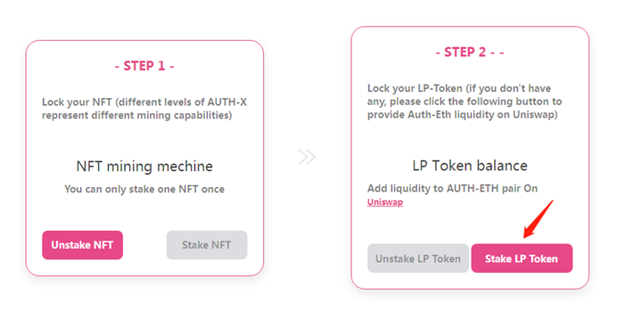

2、输入质押的LP代币数量后点击确认；

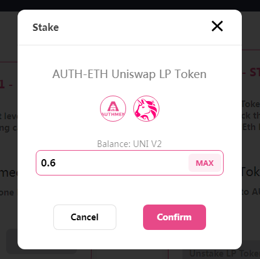

3、质押完成，开始挖矿！

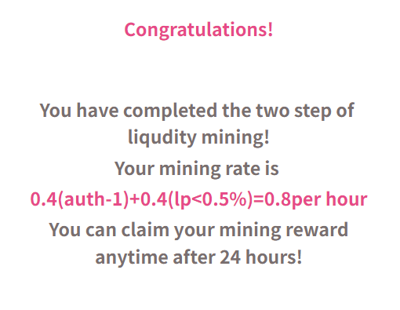

 